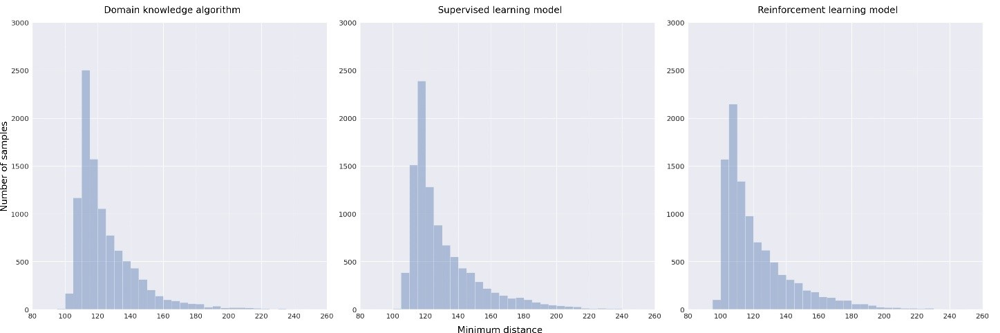
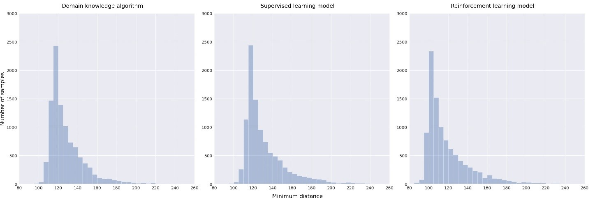

# Actor Critic DPPO algorithm (Collision Avoidance Final Results)
본 Repo는 [Imitation_learning](https://github.com/kun-woo-park/Imitation_learning)에서 이어지는 내용이다. 학습된 supervised learning model을 기반으로 DPPO알고리즘을 통해 fine tuning을 진행하였다. 최종 결과들은 [심층 강화학습을 이용한 항공기 충돌회피 모델링 및 모델 최적화.pdf](심층 강화학습을 이용한 항공기 충돌회피 모델링 및 모델 최적화.pdf)에서 작성된 논문 내용을 확인할 수 있다. 정리되지 않은 실험내용은 [Aircraft_avoidance_RL](https://github.com/aisl-khu/collision_avoidance/tree/master/Aircraft_avoidance_RL)에서 확인할 수 있다.

강화학습의 네트워크 구조로는 Actor Critic 방식을, 알고리즘으로는 PPO를 채택하였다. 그 이유는 항공기 제어환경의 state space가 넓어 high biased할 가능성이 있는 value based와 high variance할 가능성이 있는 policy based만을 사용할 경우 수렴이 어려울 것이라 판단했기 때문이다. 또한 loss의 형태를 PPO의 surrogate loss를 사용함으로써 수렴의
효율을 높일 수 있을 것이라 판단했다. 강화학습을 진행하기에 앞서, 미리 학습된 가중치를 Actor와 Critic의 초기 가중치로 설정한다. 우리가 학습시킨 네트워크는 엄밀히 말하면 Actor(policy)네트워크의 가중치이기 때문에, Critic(Value)네트워크의 가중치를 Actor에 맞게 finetuning해줄 필요가 있다고 판단했다. 따라서 몇번의 에피소드동안 Actor네트워크를 고정시킨 채 Critic 네트워크 만을 학습시키며, finetuning해주었다. 이후 Deterministic PPO를 사용하여 두 네트워크 모두 학습을 진행하였다. Deterministic한 PPO를 설계한 이유는 기존의 Stochastic한 PPO를 사용할 경우 너무 많은 exploration을 진행하여 이미 학습되어 있던 가중치에서 거리가 멀어지는 경우가 발생하여 성능 향상이 어려웠다. 따라서 exploration을 줄이기 위해 Deterministic한 PPO를 설계하였다.

## Implementation of project
```bash
git clone https://github.com/kun-woo-park/Model_Optimization_Using_DPPO.git
cd Model_Optimization_Using_DPPO
python3 setup.py install
python3 dppo_train.py
```

## Deterministic PPO algorithm
Policy network의 초기 가중치를 지도학습으로 학습된 네트워크를 사용하여 강화학습을 진행하는 방식에 기존의 PPO알고리즘에서 사용하는 형태의 stochastic policy로 action을 샘플링 할 경우 필요 이상으로 너무 많은 exploration을 진행하여 수렴에 방해요소로써 작용 한다. 따라서 학습된 네트워크 가중치를 fine tuning하기 위해 exploration의 양을 줄일 필요가 있고, 본 논문에서는 해당 문제점을 해결하기 위해 policy를 greedy한 action selection으로 deterministic하게 변경하여 학습을 진행한다. 아래는 본 연구에서 사용하는 deterministic한 policy PPO알고리즘의 순서도이다. 작성된 코드는 [dppo.py](./dppo.py)에서 확인할 수 있다.


## Value Network(Critic Network) fine tuning
Actor Critic 알고리즘은 Actor(policy) network와 Critic(value) network의 두 네트워크가 상호작용하면서 함께 학습된다. 그러나 지도학습으로 학습시킨 네트워크는 action 을 결정하는 policy에 대한 네트워크이기 때문에 초기 value network에 대한 가중치는 우리가 초기화한 policy의 가중치
에 적합하지 않다. 따라서 본 연구에서는 초기 value network를 policy network와 동일한 가중치로 초기화한 후 일정 에피소드동안 value network만을 업데이트하 면서 value network를 policy network에 맞게 fine tuning 한다. 아래는 본 연구에서 사용한 value network fine tuning 알고리즘이다.


## Reward design
본 연구에서의 reward 설계 목표는 아래와 같다.

- 최대한 적은 command 명령으로 회피를 할 것.
- 에피소드의 시작 시점을 기준으로 최대한 빠르게 명령을 줄 것.
- Command는 일정한 형태여야 하며, 회피 command가 진동하지 않을 것.

위 목표들을 모두 만족하도록 설계한 reward는 다음과 같다.


## Results
학습 결과를 확인하기 위해 먼저 강화학습 알고리즘 별로 reward의 수렴성을 비교하였다. DQN과 PPO, 그리고 DPPO로 구분하여 결과를 확인하였다. 그래프에서 DPPO의 nvt와 vt는 (not or) valuenet tuning의 약자로, Critic(Value)네트워크를 finetuning한 DPPO를 말한다. 결과적으로 Critic(Value)네트워크를 finetuning한 결과가 가장 좋은 성능(가장 높은 reward)으로 수렴했다.
### Reward plot for each RL algorithm


### Reward plot for each RL algorithm(DPPO untuned value net, DPPO tuned value net, Initial model)


### Minimum approach distance for each avoidance algorithm (Avoiding up)


### Minimum approach distance for each avoidance algorithm (Avoiding down)


최종적으로 각 회피알고리즘 별 상승회피 시나리오와 하강회피 시나리오에서 최소 접근거리의 분포를 비교한 결과, 초기의 회피알고리즘과 지도학습으로 학습된 회피 네트워크에 비해 17%가량 더 높은 회피 효율을 보였다. 여기서 회피효율은 지정된 최소 회피거리(여기선 100m로 지정)에 얼마나 가깝게 회피했는지를 평균값과 분산을 이용해 비교하였다.
