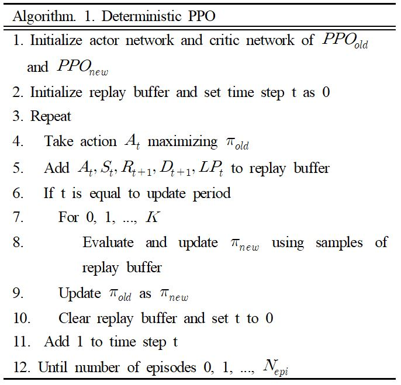
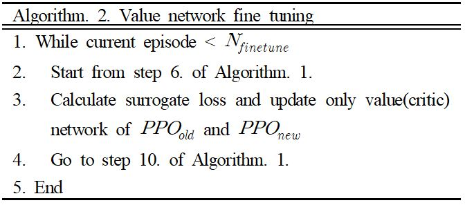
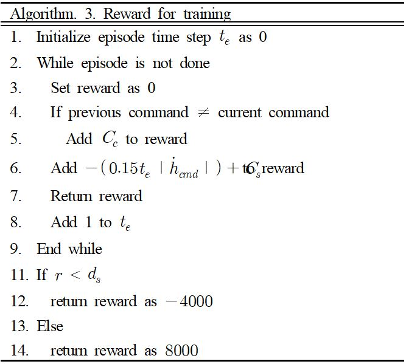
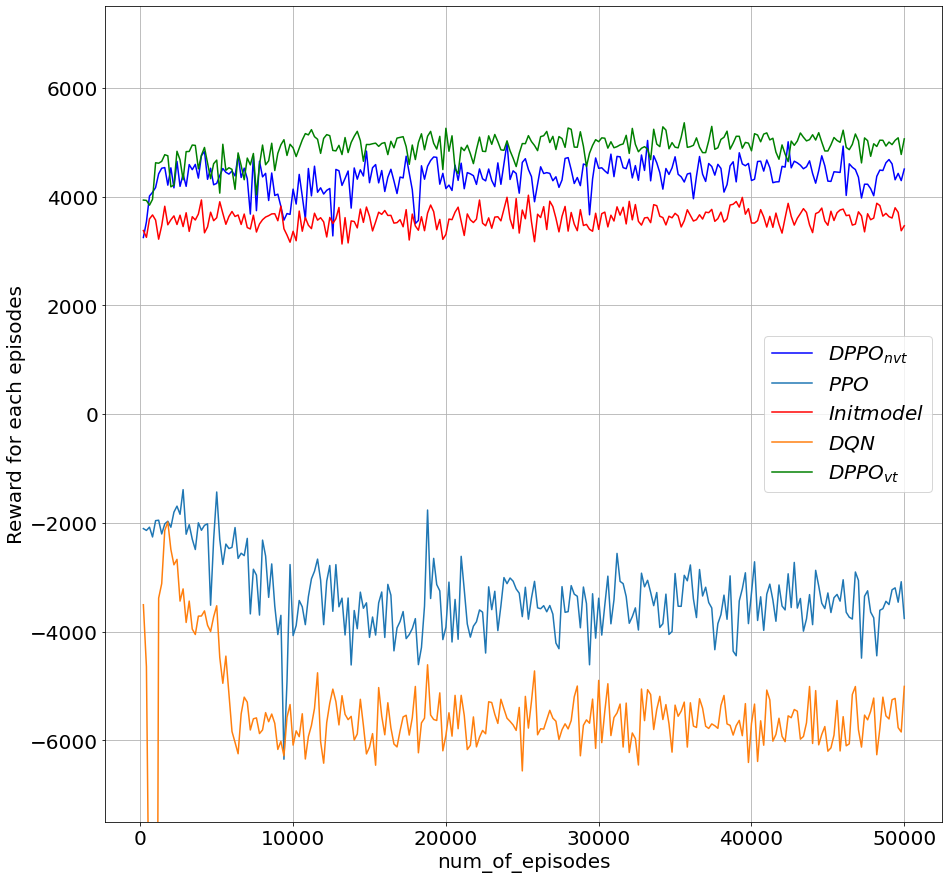
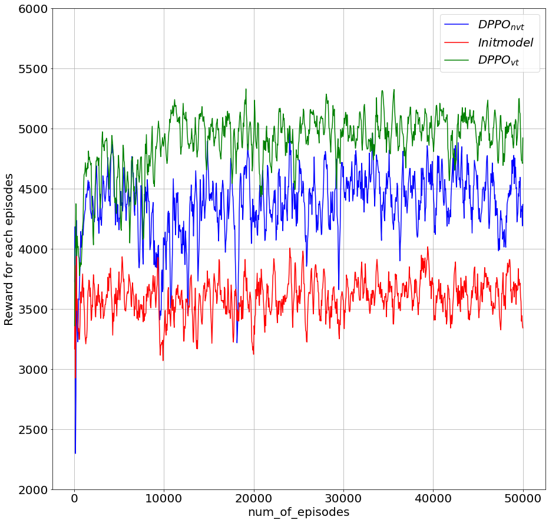

# Actor Critic PPO algorithm (Collision Avoidance Final Results)
학습된 supervised learning model을 기반으로 PPO알고리즘을 통해 fine tuning을 진행하였다. [ppo_prev_try](ppo_prev_try) 폴더는 앞서 시도한 내용들을 모아둔 폴더이다. 최종 결과들은 [ppo_fin](ppo_fin)에 정리되어 있으며, [제어학회논문_박건우_최종.pdf](제어학회_박건우_최종.pdf)에서 작성된 논문 내용을 확인할 수 있다.

## Deterministic PPO algorithm
Policy network의 초기 가중치를 지도학습으로 학습된 네트워크를 사용하여 강화학습을 진행하는 방식에 기존의 PPO알고리즘에서 사용하는 형태의 stochastic policy로 action을 샘플링 할 경우 필요 이상으로 너무 많은 exploration을 진행하여 수렴에 방해요소로써 작용 한다. 따라서 학습된 네트워크 가중치를 fine tuning하기 위해 exploration의 양을 줄일 필요가 있고, 본 논문에서는 해당 문제점을 해결하기 위해 policy를 greedy한 action selection으로 deterministic하게 변경하여 학습을 진행한다. 아래는 본 연구에서 사용하는 deterministic한 policy PPO알고리즘의 순서도이다. 작성된 코드는 [ppo_lr_schedule_2.py](./ppo_fin/ppo_lr_schedule_2.py)에서 확인할 수 있다.

## Value Network(Critic Network) fine tuning
Actor Critic 알고리즘은 Actor(policy) network와 Critic(value) network의 두 네트워크가 상호작용하면서 함께 학습된다. 그러나 지도학습으로 학습시킨 네트워크는 action 을 결정하는 policy에 대한 네트워크이기 때문에 초기 value network에 대한 가중치는 우리가 초기화한 policy의 가중치
에 적합하지 않다. 따라서 본 연구에서는 초기 value network를 policy network와 동일한 가중치로 초기화한 후 일정 에피소드동안 value network만을 업데이트하 면서 value network를 policy network에 맞게 fine tuning 한다. 아래는 본 연구에서 사용한 value network fine tuning 알고리즘이다.

## Reward design
본 연구에서의 reward 설계 목표는 아래와 같다.

- 최대한 적은 command 명령으로 회피를 할 것.
- 에피소드의 시작 시점을 기준으로 최대한 빠르게 명령을 줄 것.
- Command는 일정한 형태여야 하며, 회피 command가 진동하지 않을 것.

위 목표들을 모두 만족하도록 설계한 reward는 다음과 같다.

## Results
아래 두 결과들은 기존의 강화학습 알고리즘들 몇가지와 본 연구에 사용된 알고리즘의 reward 수렴 결과이다. 사용된 알고리즘들은 기존의 PPO방식(PPO_nm)과 DQN방식(DQN_nm), 초기 weight를 supervised model의 weight로 초기화한 PPO(PPO_wm)와 DQN(DQN_wm), 그리고 본 연구에서 제안된 deterministic policy와 value net fine tuning을 적용한 PPO(PPO_vt)방식이다. 각 알고리즘들은 동일한 seed의 환경에서 진행되었으며, 각 그래프의 Initmodel 곡선은 초기의 supervised model에 대한 reward의 값이다. 결과를 보면, 초기 weight가 supervised model로 초기화된 PPO방식들의 reward가 월등히 높게 수렴함을 알 수 있다. 이 PPO방식들 중 본 연구에서 활용된 학습 방식의 reward가 기존의 PPO알고리즘만을 사용한 방식보다 11% 가량 더 높은 reward에 수렴하였다.
### Plot res-1

### Plot res-2

